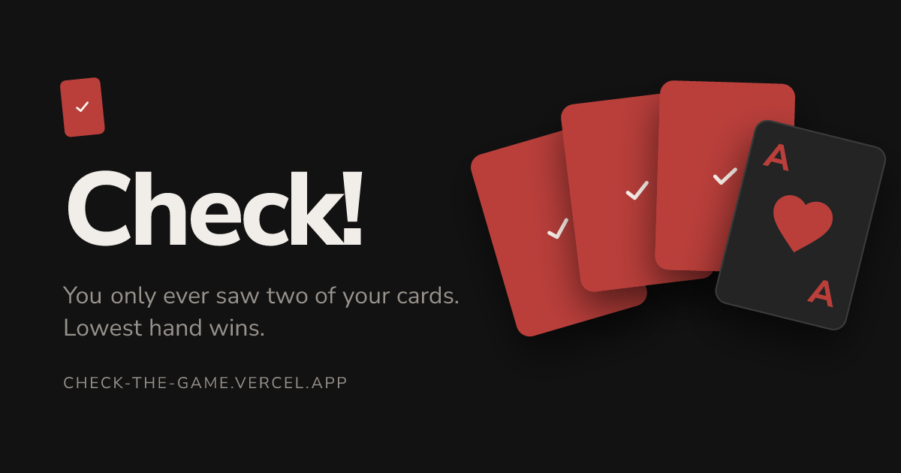

# Check!

[](https://github.com/vroslmend/check-the-card-game-v2/actions/workflows/ci.yml)

A browser card game for two to six players, built with Next.js, Socket.IO and XState.

### [Play it at check-the-game.vercel.app](https://check-the-game.vercel.app)

Free, no account, no install. Create a table and send your friends the invite link.

[](https://check-the-game.vercel.app)

_[Rules](https://check-the-game.vercel.app/rules)_ · _[Architecture](docs/ARCHITECTURE.md)_ · _[Contributing](CONTRIBUTING.md)_

## The game

You are dealt four cards face down and get one look at two of them. Lowest hand wins, and Aces are worth minus one.

On your turn you draw, then either swap the card into a hand you half remember or throw it away. Every discard opens a window: anyone holding the same rank can throw their own card away and shrink their hand. Get it wrong and you take a penalty card. Reach eight cards and you are out for the round.

Kings, Queens and Jacks do something extra when discarded, letting you look at a card or swap one with another player.

Call Check when you think you are lowest. Everyone else gets one more turn, then hands are revealed.

## Running locally

```bash
npm ci
npm run build:shared
npm run dev
```

Client on `localhost:3000`, server on `localhost:8000`. Copy the `.env.example` files in `client/` and `server/` if you want to change ports, timers or table size.

Read [CONTRIBUTING.md](CONTRIBUTING.md) before opening a pull request. Open work is in [issues](https://github.com/vroslmend/check-the-card-game-v2/issues).

## Licence

The source is public. You may read, fork and modify it for personal, non-commercial and educational use, and the hosted game is free to play. Commercial use, redistribution and running a competing public instance are not permitted. See [LICENSE.md](LICENSE.md), and the contribution terms in [CONTRIBUTING.md](CONTRIBUTING.md) if you plan to send code.
